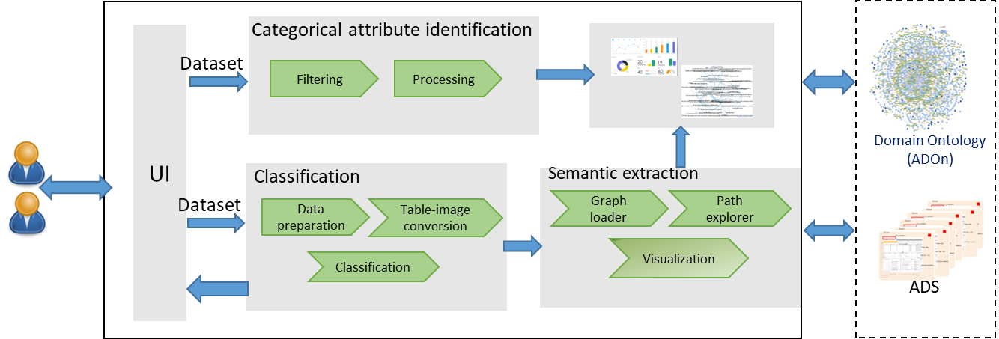
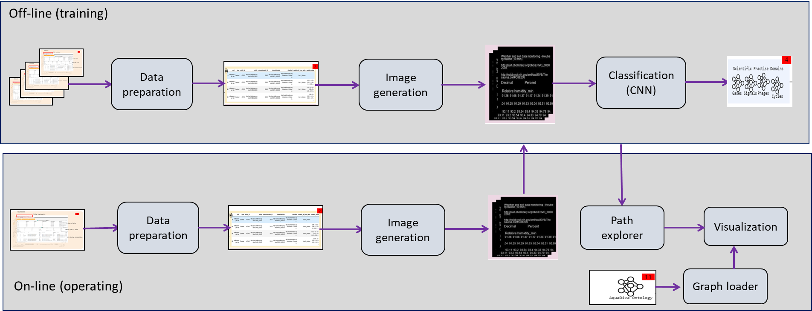
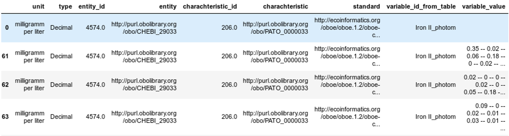
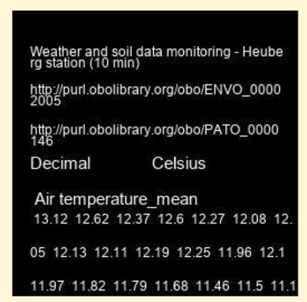
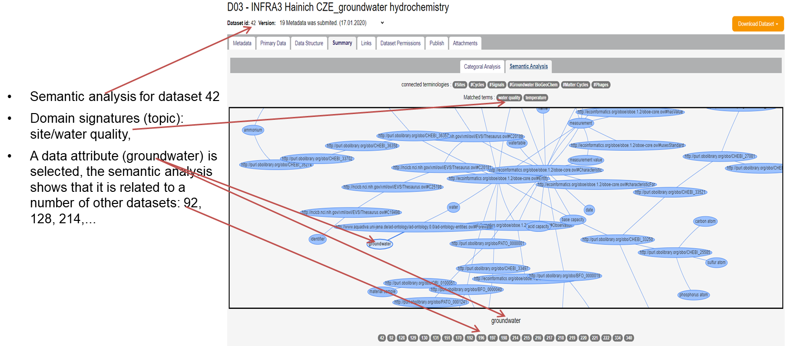

---
# Feel free to add content and custom Front Matter to this file.
# To modify the layout, see https://jekyllrb.com/docs/themes/#overriding-theme-defaults
# #  
layout: home
---

Welcome to the website of the **JeDaSS** project! 

# Towards Scientific Data Synthesis Using Deep Learning and Semantic Web

## Introduction
 * One of the added values of long-running and large-scale collaborative projects is the ability to answer complex research questions based on the comprehensive set of data provided by their central repositories. 
 * In practice, however, finding data in such a repository to answer a specific question often proves to be a demanding task even for project scientists. 
 * In this poster, we aim to ease this task, thereby enabling cross-cutting analyses. 
 * To achieve that we introduce a new data analysis and summarization approach combining semantic web and machine learning approaches. 
 * In particular, the proposed approach makes use of the capability of machine learning to categorize a given dataset into a domain topic and to extract hidden links between its data attributes and data attributes from other datasets. 
 * The proposed approach has been developed in the frame of [CRC AquaDiva](http://www.aquadiva.uni-jena.de/) has been applied to its datasets.

 

##  Motivation

 * The Collaborative Research Center (CRC) AquaDiva is a large collaborative project spanning a variety of domains including biology, geology, chemistry, and computer science with the common goal to better understand the Earth’s critical zone. 
 *  Datasets collected within AquaDiva, like those of many other cross-institutional, cross-domain research projects, are complex and difficult to reuse since they are highly diverse and heterogeneous.
 *  This limits the dataset accessibility to the few people who were either involved in creating the datasets or have spent a significant amount of time aiming to understand them.
 *  Furthermore, more time is needed to figure out the major theme of unfamiliar datasets.
 
We believe that dataset analysis and summarization can be used as an elegant way to provide a concise overview of an entire dataset.

## Definitions
* A *dataset (DS)* is defined as a tuple _<PD, MD>_ of *primary data (PD)* and *metadata (MD)* organized for a specific purpose.
* _PM_ represents the actual data organized according to a specific structure, called *data structure (DT)*
* *DT* consists of a set of *data attributes (i.e. _DT={da1, da2,...,dtn}_)*
* Each data attribute has a name, datatype,(optional) unit, description, as well as annotation based on a domain ontology.
* Each tuple in the primary data is a collection of data cells containing data values (called data points).
* The metadata contains information about,e.g., the data owner, data curators, the methodology used to produce primary data, etc.

In our implementation, almost all data attributes of available datasets are annotated using the AquaDiva ontology (ADOn) as the domain-specific ontology.

## Methodology

* Developing new data analysis and summarization approach 
   * combining semantic web and machine learning approaches
   * Semantically classifies data attributes of scientific datasets (tabular data) 
   *  This classification contributes to summarizing individual datasets, but also to link them to others. 
  
  
 
 * The proposed approach has two main phases:
   * _off-line_ to train and build a classification model using supervised deep learning using convolution layers and
   * _on-line_ making use of the pre-trained model to classify datasets into the learned categories.
 
 

### Data preparation
 
 * Proposing a new structure capturing several features from the _dataset_ into a single container
 * As _data attributes_ are the most important parts of the _dataset_, gathering all information related to _data attributes_
 * Considering for each data attribute we consider the name, datatype, unit, data points attached to the data attribute as well as its semantic annotation. 

   
 
 ### Image generation
 
 * Proposing a method to transform the constructed new structure into a number of images, where a set of images is generated for each data attribute
 *  Figure 2 illustrates the ”Airtemperaturemean” data attributes from the” Weather and soil data monitoring” along with its annotation, data type (decimal), unit(Celsius), and 30 data points
 
 
 ### Classification
 
 
 
  
 
 ## Prelimanry results
  
 
 

## Availability
 The resources related to the development of the proposed approach can be found at the [GitHub](https://github.com/fusion-jena/JeDaSS)

 

# People
* [Alsayed Algergawy](https://fusion.cs.uni-jena.de/fusion/members/alsayed-algergawy/), Heinz-Nixdorf  Chair for Distributed Information Systems, University of Jena
* [Hamdi Hamed](https://fusion.cs.uni-jena.de/fusion/members/hamdi-Hamed/), Heinz-Nixdorf  Chair for Distributed Information Systems, University of Jena
* [Birgitta König-Ries](https://fusion.cs.uni-jena.de/fusion/members/birgitta-konig-ries/), Heinz-Nixdorf  Chair for Distributed Information Systems, University of Jena

 

# Acknolwedgement

* This work has been funded by the Deutsche Forschungsgemeinschaft([CRC AquaDiva](http://www.aquadiva.uni-jena.de/), Project 218627073)

<!--
### News
**23 Sep 2020**:
-->
<!-- This is a comment in markdown -->
